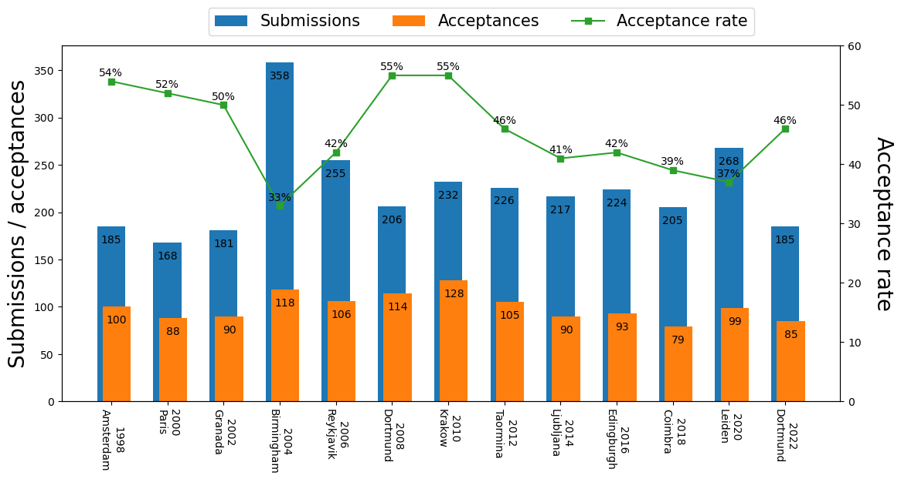
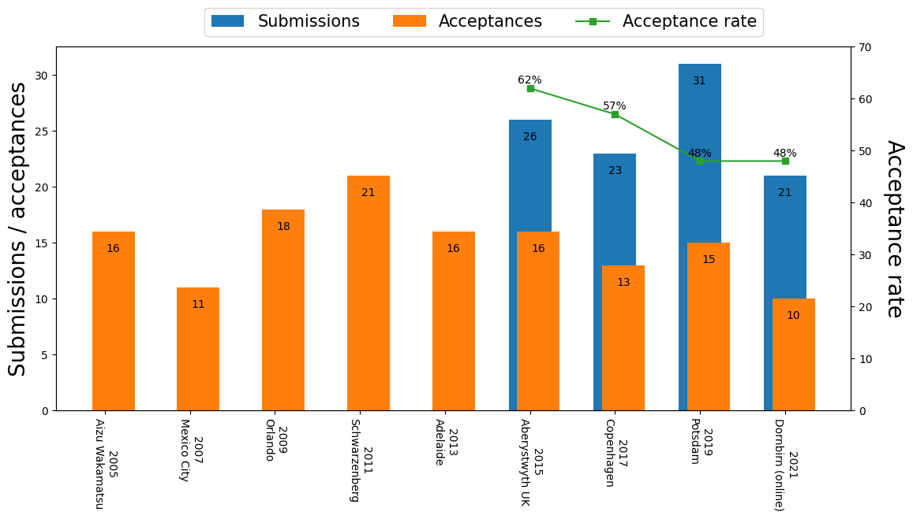
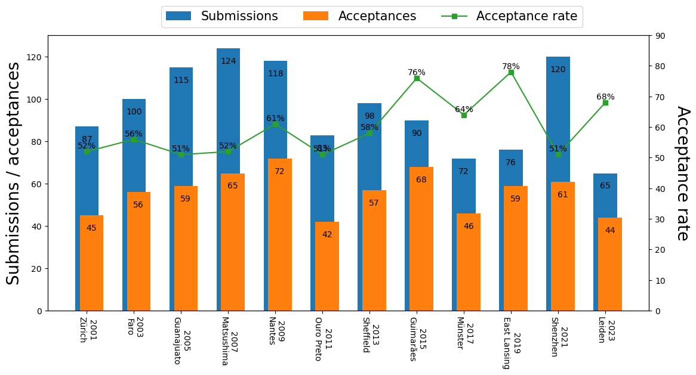

# Statistics of acceptance rate for evolutionary computation conferences

This provides statistics of acceptance rate for the main evolutionary computation conferences for my own interest. Since I collected data manually, some statistics may be incorrect. If you found some errors, please email me (Ryoji Tanabe, rt.ryoji.tanabe [at] gmail.com) or send a pull request.

## GECCO: ACM Genetic and Evolutionary Computation Conference

### References
- [SIGEVOlution (volume 10, issue 3)](https://evolution.sigevo.org/issues/SIGEVOlution1003.pdf)
- The front matter of each GECCO proceeding

|      |            |            |                 |               | 
|------|------------|------------|-----------------|---------------| 
| Year | Submission | Acceptance | Acceptance rate | Place         | 
| 2001 | 352        | 170        | 48%             | San Francisco | 
| 2002 | 322        | 160        | 50%             | New York      | 
| 2003 | 417        | 194        | 47%             | Chicago       | 
| 2004 | 460        | 230        | 50%             | Seattle       | 
| 2005 | 549        | 253        | 46%             | Washington DC | 
| 2006 | 446        | 205        | 46%             | Seattle       | 
| 2007 | 577        | 266        | 46%             | London        | 
| 2008 | 451        | 200        | 44%             | Atlanta       | 
| 2009 | 531        | 220        | 41%             | Montreal      | 
| 2010 | 373        | 169        | 45%             | Portland      | 
| 2011 | 686        | 261        | 38%             | Dublin        | 
| 2012 | 467        | 172        | 37%             | Philadelphia  | 
| 2013 | 570        | 204        | 36%             | Amsterdam     | 
| 2014 | 544        | 180        | 33%             | Vancouver     | 
| 2015 | 505        | 182        | 36%             | Madrid        | 
| 2016 | 381        | 138        | 36%             | Denver        | 
| 2017 | 464        | 181        | 39%             | Berlin        | 
| 2018 | 514        | 195        | 38%             | Kyoto         | 
| 2019 | 501        | 173        | 35%             | Prague        | 
| 2020 | 415        | 149        | 36%             | Cancun        | 

 

## PPSN: Parallel Problem Solving from Nature

### References
- [SIGEVOlution (volume 11, issue 3)](https://evolution.sigevo.org/issues/SIGEVOlution1103.pdf)
- The front matter of each PPSN proceeding

### Note

PPSN is held in even years.

|      |            |            |                 |            | 
|------|------------|------------|-----------------|------------| 
| Year | Submission | Acceptance | Acceptance rate | Place      | 
| 1998 | 185        | 100        | 54%             | Amsterdam  | 
| 2000 | 168        | 88         | 52%             | Paris      | 
| 2002 | 181        | 90         | 50%             | Granada    | 
| 2004 | 358        | 118        | 33%             | Birmingham | 
| 2006 | 255        | 106        | 42%             | Reykjavik  | 
| 2008 | 206        | 114        | 55%             | Dortmund   | 
| 2010 | 232        | 128        | 55%             | Krakow     | 
| 2012 | 226        | 105        | 46%             | Taormina   | 
| 2014 | 217        | 90         | 41%             | Ljubljana  | 
| 2016 | 224        | 93         | 42%             | Edingburgh | 
| 2018 | 205        | 79         | 39%             | Coimbra    | 
| 2020 | 268        | 99         | 37%             | Leiden     | 

 

## CEC: IEEE CEC

### References
- [The review written by Prof. Hisao Ishibuchi and Prof. Hisashi Handa](https://www.jstage.jst.go.jp/article/tjpnsec/1/1/1_1_15/_pdf/-char/ja)
- The CEC/WCCI conference reports in IEEE CIM

### Note

CEC is held as a part of WCCI in even years. Statistics of WCCI/CEC2016 and WCCI/CEC2018 are missing.

|      |            |            |                 |                | 
|------|------------|------------|-----------------|----------------| 
| Year | Submission | Acceptance | Acceptance rate | Place          | 
| 2001 | 252        | 174        | 69%             | Seoul          | 
| 2002 | 372        | 264        | 71%             | Hawaii         | 
| 2003 | 545        | 383        | 70%             | Canberra       | 
| 2004 | 460        | 328        | 71%             | Portland       | 
| 2005 | 660        | 379        | 57%             | Edinburgh      | 
| 2006 | 792        | 451        | 57%             | Vancouver      | 
| 2007 | 1115       | 653        | 59%             | Singapore      | 
| 2008 | 867        | 604        | 70%             | Hong Kong      | 
| 2009 | 723        | 448        | 62%             | Trondheim      | 
| 2010 | 1027       | 622        | 61%             | Barcelona      | 
| 2011 | 631        | 410        | 65%             | New Orleans    | 
| 2012 | 758        | 482        | 64%             | Bris-bane      | 
| 2013 | 751        | 443        | 59%             | Cancún         | 
| 2014 | 869        | 437        | 50%             | Beijing        | 
| 2015 | 701        | 455        | 65%             | Sendai         | 
| 2016 | NaN        | 703        | NaN             | Vancouver      | 
| 2017 | 622        | 358        | 58%             | San Sebastian  | 
| 2018 | NaN        | 347        | NaN             | Rio de Janeiro | 
| 2019 | 791        | 443        | 56%             | New Zealand    | 
| 2020 | 690        | 426        | 62%             | Glasgow        | 

 

## FOGA: ACM/SIGEVO Workshop on Foundations of Genetic Algorithms

### References
- The front matter of each FOGA proceeding

### Note

FOGA has been held in odd years since 2005.
Statistics of most FOGA conferences are missing.
Although proceedings of FOGA1990 -- FOGA2002 were published by Morgan Kaufmann Publishers, they are currently unavailable.

|      |            |            |                 |                 | 
|------|------------|------------|-----------------|-----------------| 
| Year | Submission | Acceptance | Acceptance rate | Place           | 
| 2005 | NaN        | 16         | NaN             | Aizu Wakamatsu  | 
| 2007 | NaN        | 11         | NaN             | Mexico City     | 
| 2009 | NaN        | 18         | NaN             |  Orlando        | 
| 2011 | NaN        | 21         | NaN             | Schwarzenberg   | 
| 2013 | NaN        | 16         | NaN             |  Adelaide       | 
| 2015 | 26         | 16         | 62%             |  Aberystwyth UK | 
| 2017 | 23         | 13         | 57%             | Copenhagen      | 
| 2019 | 31         | 15         | 48%             |  Potsdam        | 

 

## EMO: Conference on Evolutionary Multi-Criterion Optimization 

### References
- The front matter of each EMO proceeding

### Note

EMO is held in odd years.

|      |            |            |                 |              | 
|------|------------|------------|-----------------|--------------| 
| Year | Submission | Acceptance | Acceptance rate | Place        | 
| 2001 | 87         | 45         | 52%             | Zurich       | 
| 2003 | 100        | 56         | 56%             | Faro         | 
| 2005 | 115        | 59         | 51%             | Guanajuato   | 
| 2007 | 124        | 65         | 52%             | Matsushima   | 
| 2009 | 118        | 72         | 61%             | Nantes       | 
| 2011 | 83         | 42         | 51%             | Ouro Preto   | 
| 2013 | 98         | 57         | 58%             | Sheffield    | 
| 2015 | 90         | 68         | 76%             | Guimarães    | 
| 2017 | 72         | 46         | 64%             | Münster      | 
| 2019 | 76         | 59         | 78%             | East Lansing | 

 

## EuroGP: European Conference on Genetic Programming

### References
- The front matter of each EuroGP proceeding

### Note

EuroGP is held as a part of Evostar, which consists of EuroGP, EvoApplications, EvoCOP, and EvoMUSART.

|      |            |            |                 |            | 
|------|------------|------------|-----------------|------------| 
| Year | Submission | Acceptance | Acceptance rate | Place      | 
| 2001 | 42         | 30         | 71%             | Lake Como  | 
| 2002 | 42         | 32         | 76%             | Kinsale    | 
| 2003 | 61         | 45         | 74%             | Essex      | 
| 2004 | 61         | 38         | 62%             | Coimbra    | 
| 2005 | 64         | 34         | 53%             | Lausanne   | 
| 2006 | 59         | 32         | 54%             | Budapest   | 
| 2007 | 71         | 35         | 49%             | Valencia   | 
| 2008 | 61         | 31         | 51%             | Naples     | 
| 2009 | 57         | 30         | 53%             | Tübingen   | 
| 2010 | 48         | 28         | 58%             | Istanbul   | 
| 2011 | 59         | 29         | 49%             | Torino     | 
| 2012 | 46         | 23         | 50%             | Málaga     | 
| 2013 | 47         | 23         | 49%             | Vienna     | 
| 2014 | 40         | 20         | 50%             | Granada    | 
| 2015 | 36         | 18         | 50%             | Copenhagen | 
| 2016 | 36         | 19         | 53%             | Porto      | 
| 2017 | 34         | 22         | 65%             | Amsterdam  | 
| 2018 | 36         | 19         | 53%             | Parma      | 
| 2019 | 36         | 18         | 50%             | Leipzig    | 
| 2020 | 36         | 18         | 50%             | Seville    | 

 

