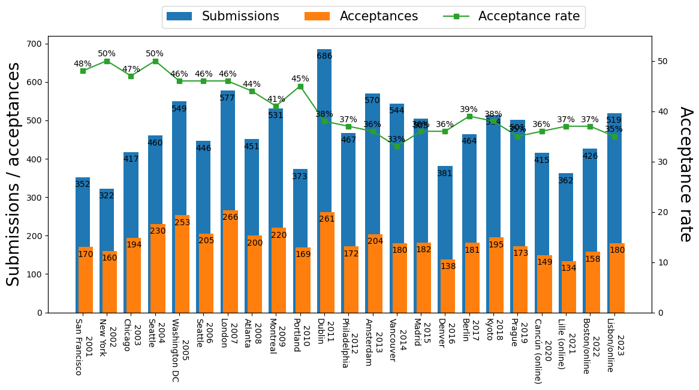
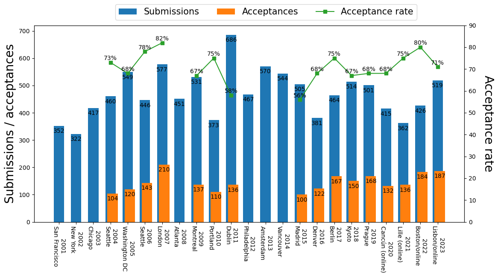
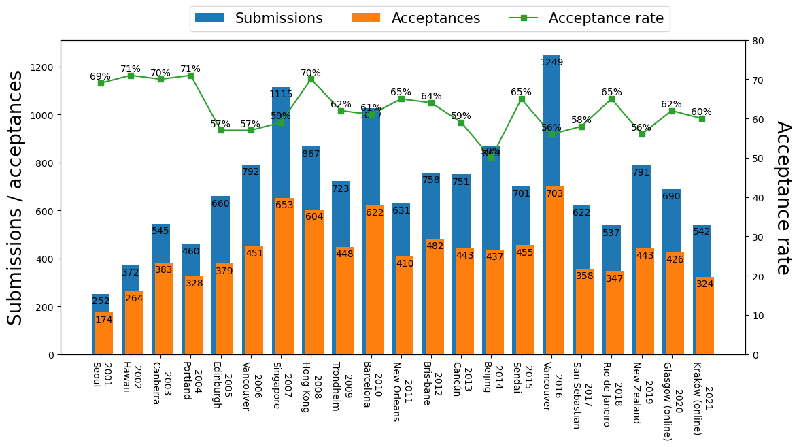
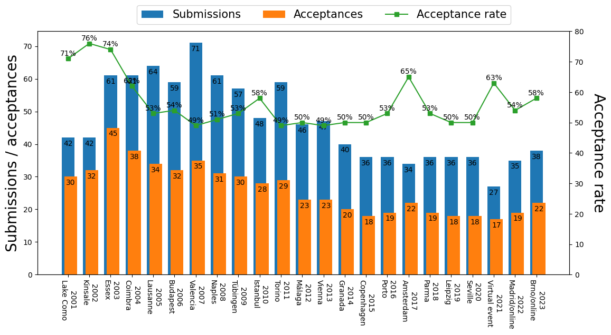
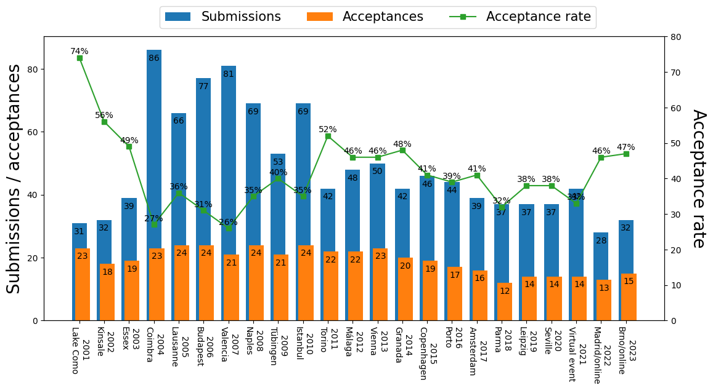
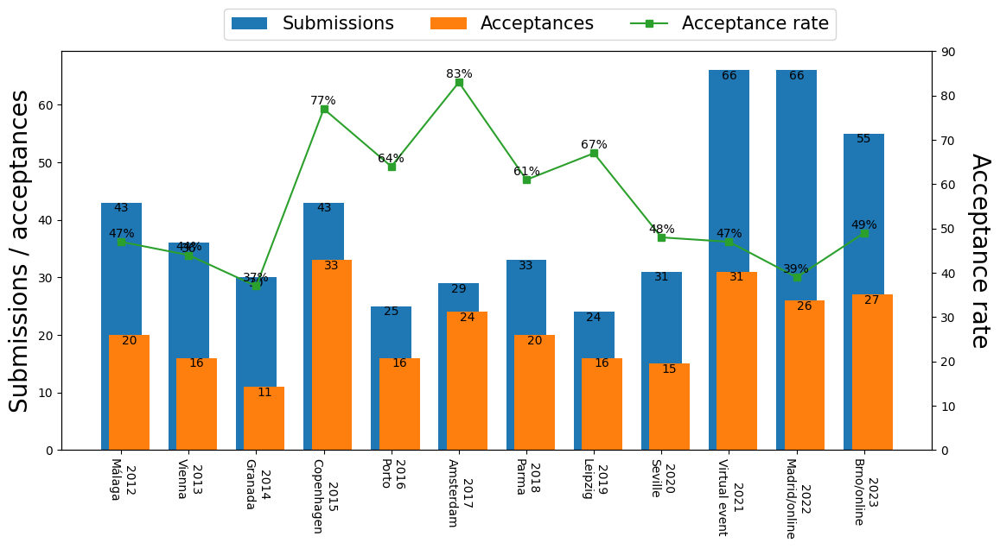

# Statistics of acceptance rates of the main evolutionary computation conferences

This web site provides statistics of acceptance rates of the main evolutionary computation conferences for my own interest. I carefully collected data, but some of them may be incorrect. If there are any mistakes, please email me ([Ryoji Tanabe](https://ryojitanabe.github.io/), rt.ryoji.tanabe [at] gmail.com) or send a pull request from [here](https://github.com/ryojitanabe/ecconf).

## Table of contents

* [Upcoming conferences](#nextconf)
* [CORE2018 rankings](#coreranks)
* [GECCO: ACM Genetic and Evolutionary Computation Conference](#gecco)
* [GECCO (two-page poster papers)](#geccoposter)
* [PPSN: Parallel Problem Solving from Nature](#ppsn)
* [CEC: IEEE Congress on Evolutionary Computation](#cec)
* [FOGA: ACM/SIGEVO Workshop on Foundations of Genetic Algorithms](#foga)
* [EMO: Conference on Evolutionary Multi-Criterion Optimization](#emo)
* EvoStar
    * [EuroGP: EuroGP: European Conference on Genetic Programming](#eurogp)
    * [EvoCOP: European Conference on Evolutionary Computation in Combinatorial Optimisation](#evocop)
    * [EvoMUSART: International Conference on Artificial Intelligence in Music, Sound, Art and Design](#evomusart)
    * [EvoApplications: International Conference on the Applications of Evolutionary Computation](#evoapp)

## <a id="nextconf" href="#nextconf">Upcoming conferences</a> 

The date format in the following table is ``Year/Month/Day``. The submission deadline for each conference is based on its first CFP.

|  Conference  | Venue | Dates | Submission deadline | 
|    |  | Start | End | Abstract | Full paper | 
| ---- | ---- | ---- | ---- |
| [EMO 2021](https://emo2021.org/) | Shenzhen, China | 2021/March/28 | 2021/March/31 | | 2020/October/10 |
| [Evo\* 2021](http://www.evostar.org/2021/) | Seville, Spain | 2021/April/7 | 2021/April/9 | |  2020/November/1 |
| [CEC 2021](https://cec2021.mini.pw.edu.pl/) | Kraków, Poland | 2021/June/28 | 2021/July/1 |  | 2021/January/31 |
| [GECCO 2021](https://gecco-2021.sigevo.org/HomePage) | Lille, France | 2021/July/10 | 2021/July/14| 2021/January/28 | 2021/February/4|
| [FOGA 2021](https://www.fhv.at/foga2021/) | Dornbirn, Austria | 2021/September/6 | 2021/September/8  | | 2021/April/30 |

## <a id="coreranks" href="#coreranks">CORE2018 rankings</a> 

|  Conference  |  CORE2018  |
| ---- | ---- |
| FOGA | A* |
| GECCO | A |
| PPSN | A |
| EuroGP | B |
| CEC | B |

## <a id="gecco" href="#gecco">GECCO: ACM Genetic and Evolutionary Computation Conference</a> 

### References
- [SIGEVOlution (volume 10, issue 3)](https://evolution.sigevo.org/issues/SIGEVOlution1003.pdf)
- The front matter of each GECCO proceeding

### Note

This table provides statistics of full papers, not two-page poster papers.

| Year | Submission | Acceptance | Acceptance rate | Place         | 
| 2001 | 352        | 170        | 48%             | San Francisco | 
| 2002 | 322        | 160        | 50%             | New York      | 
| 2003 | 417        | 194        | 47%             | Chicago       | 
| 2004 | 460        | 230        | 50%             | Seattle       | 
| 2005 | 549        | 253        | 46%             | Washington DC | 
| 2006 | 446        | 205        | 46%             | Seattle       | 
| 2007 | 577        | 266        | 46%             | London        | 
| 2008 | 451        | 200        | 44%             | Atlanta       | 
| 2009 | 531        | 220        | 41%             | Montreal      | 
| 2010 | 373        | 169        | 45%             | Portland      | 
| 2011 | 686        | 261        | 38%             | Dublin        | 
| 2012 | 467        | 172        | 37%             | Philadelphia  | 
| 2013 | 570        | 204        | 36%             | Amsterdam     | 
| 2014 | 544        | 180        | 33%             | Vancouver     | 
| 2015 | 505        | 182        | 36%             | Madrid        | 
| 2016 | 381        | 138        | 36%             | Denver        | 
| 2017 | 464        | 181        | 39%             | Berlin        | 
| 2018 | 514        | 195        | 38%             | Kyoto         | 
| 2019 | 501        | 173        | 35%             | Prague        | 
| 2020 | 415        | 149        | 36%             | Cancun        | 

 

## <a id="geccoposter" href="#geccoposter">GECCO two-page poster papers </a> 

### References
- The front matter of each GECCO proceeding

### Note

This table provides statistics of two-page poster papers, not full papers. Unlike other conferences in the field of evolutionary computation (e.g., CEC, EMO, and Evo\*), poster papers and full papers are published individually in GECCO. While full papers are published in the main volume, poster papers are published in the companion volume ([dblp](https://dblp1.uni-trier.de/db/conf/gecco/)). 

It is not obvious how to calculate the acceptance rates of GECCO poster papers. I calculated the acceptance rate for each year as follows: (x + y) / z, where x is the number of full paper acceptances, y is the number of poster paper acceptances, and z is the number of submissions. I believe that the acceptance rate obtained in this way is inexact, but a good approximation.

| Year | Submission | Acceptance | Acceptance-full | Acceptance rate | Place         | 
| 2001 | 352        | Na        | 170             | Na             | San Francisco | 
| 2002 | 322        | Na        | 160             | Na             | New York      | 
| 2003 | 417        | Na        | 194             | Na             | Chicago       | 
| 2004 | 460        | 104        | 230             | 73%             | Seattle       | 
| 2005 | 549        | 120        | 253             | 68%             | Washington DC | 
| 2006 | 446        | 143        | 205             | 78%             | Seattle       | 
| 2007 | 577        | 210        | 266             | 82%             | London        | 
| 2008 | 451        | Na        | 200             | Na             | Atlanta       | 
| 2009 | 531        | 137        | 220             | 67%             | Montreal      | 
| 2010 | 373        | 110        | 169             | 75%             | Portland      | 
| 2011 | 686        | 136        | 261             | 58%             | Dublin        | 
| 2012 | 467        | Na        | 172             | Na             | Philadelphia  | 
| 2013 | 570        | Na        | 204             | Na             | Amsterdam     | 
| 2014 | 544        | Na        | 180             | Na             | Vancouver     | 
| 2015 | 505        | 100        | 182             | 56%             | Madrid        | 
| 2016 | 381        | 122        | 138             | 68%             | Denver        | 
| 2017 | 464        | 167        | 181             | 75%             | Berlin        | 
| 2018 | 514        | 150        | 195             | 67%             | Kyoto         | 
| 2019 | 501        | 168        | 173             | 68%             | Prague        | 
| 2020 | 415        | 132        | 149             | 68%             | Cancun        | 

 

## <a id="ppsn" href="#ppsn">PPSN: Parallel Problem Solving from Nature</a> 

### References
- [SIGEVOlution (volume 11, issue 3)](https://evolution.sigevo.org/issues/SIGEVOlution1103.pdf)
- The front matter of each PPSN proceeding

### Note

PPSN is held in even years. 

| Year | Submission | Acceptance | Acceptance rate | Place      | 
| 1998 | 185        | 100        | 54%             | Amsterdam  | 
| 2000 | 168        | 88         | 52%             | Paris      | 
| 2002 | 181        | 90         | 50%             | Granada    | 
| 2004 | 358        | 118        | 33%             | Birmingham | 
| 2006 | 255        | 106        | 42%             | Reykjavik  | 
| 2008 | 206        | 114        | 55%             | Dortmund   | 
| 2010 | 232        | 128        | 55%             | Krakow     | 
| 2012 | 226        | 105        | 46%             | Taormina   | 
| 2014 | 217        | 90         | 41%             | Ljubljana  | 
| 2016 | 224        | 93         | 42%             | Edingburgh | 
| 2018 | 205        | 79         | 39%             | Coimbra    | 
| 2020 | 268        | 99         | 37%             | Leiden     | 

 

## <a id="cec" href="#cec">CEC: IEEE Congress on Evolutionary Computation</a> 

### References
- [The review written by Prof. Hisao Ishibuchi and Prof. Hisashi Handa (in Japanese)](https://www.jstage.jst.go.jp/article/tjpnsec/1/1/1_1_15/_pdf/-char/ja)
- The CEC/WCCI conference reports in the IEEE CIM

### Note

CEC is held as part of WCCI in even years. Statistics of WCCI/CEC2016 and WCCI/CEC2018 are missing.

| Year | Submission | Acceptance | Acceptance rate | Place          | 
| 2001 | 252        | 174        | 69%             | Seoul          | 
| 2002 | 372        | 264        | 71%             | Hawaii         | 
| 2003 | 545        | 383        | 70%             | Canberra       | 
| 2004 | 460        | 328        | 71%             | Portland       | 
| 2005 | 660        | 379        | 57%             | Edinburgh      | 
| 2006 | 792        | 451        | 57%             | Vancouver      | 
| 2007 | 1115       | 653        | 59%             | Singapore      | 
| 2008 | 867        | 604        | 70%             | Hong Kong      | 
| 2009 | 723        | 448        | 62%             | Trondheim      | 
| 2010 | 1027       | 622        | 61%             | Barcelona      | 
| 2011 | 631        | 410        | 65%             | New Orleans    | 
| 2012 | 758        | 482        | 64%             | Bris-bane      | 
| 2013 | 751        | 443        | 59%             | Cancún         | 
| 2014 | 869        | 437        | 50%             | Beijing        | 
| 2015 | 701        | 455        | 65%             | Sendai         | 
| 2016 | Na        | 703        | Na             | Vancouver      | 
| 2017 | 622        | 358        | 58%             | San Sebastian  | 
| 2018 | Na        | 347        | Na             | Rio de Janeiro | 
| 2019 | 791        | 443        | 56%             | New Zealand    | 
| 2020 | 690        | 426        | 62%             | Glasgow        | 

 

## <a id="foga" href="#foga">FOGA: ACM/SIGEVO Workshop on Foundations of Genetic Algorithms</a> 

### References
- The front matter of each FOGA proceeding

### Note

FOGA has been held in odd years since 2005. Statistics of most FOGA conferences are missing. Although proceedings of FOGA1990 -- FOGA2002 were published by Morgan Kaufmann Publishers, they are currently unavailable.

| Year | Submission | Acceptance | Acceptance rate | Place           | 
| 2005 | Na        | 16         | Na             | Aizu Wakamatsu  | 
| 2007 | Na        | 11         | Na             | Mexico City     | 
| 2009 | Na        | 18         | Na             |  Orlando        | 
| 2011 | Na        | 21         | Na             | Schwarzenberg   | 
| 2013 | Na        | 16         | Na             |  Adelaide       | 
| 2015 | 26         | 16         | 62%             |  Aberystwyth UK | 
| 2017 | 23         | 13         | 57%             | Copenhagen      | 
| 2019 | 31         | 15         | 48%             |  Potsdam        | 

 

## <a id="emo" href="#emo">EMO: Conference on Evolutionary Multi-Criterion Optimization</a> 

### References
- The front matter of each EMO proceeding

### Note

EMO is held in odd years.

| Year | Submission | Acceptance | Acceptance rate | Place        | 
| 2001 | 87         | 45         | 52%             | Zurich       | 
| 2003 | 100        | 56         | 56%             | Faro         | 
| 2005 | 115        | 59         | 51%             | Guanajuato   | 
| 2007 | 124        | 65         | 52%             | Matsushima   | 
| 2009 | 118        | 72         | 61%             | Nantes       | 
| 2011 | 83         | 42         | 51%             | Ouro Preto   | 
| 2013 | 98         | 57         | 58%             | Sheffield    | 
| 2015 | 90         | 68         | 76%             | Guimarães    | 
| 2017 | 72         | 46         | 64%             | Münster      | 
| 2019 | 76         | 59         | 78%             | East Lansing | 

 

## <a id="eurogp" href="#eurogp">EuroGP: European Conference on Genetic Programming</a> 

### References
- The front matter of each EuroGP proceeding

### Note

EuroGP is held as part of EvoStar, which consists of EuroGP, EvoApplications, EvoCOP, and EvoMUSART.

| Year | Submission | Acceptance | Acceptance rate | Place      | 
| 2001 | 42         | 30         | 71%             | Lake Como  | 
| 2002 | 42         | 32         | 76%             | Kinsale    | 
| 2003 | 61         | 45         | 74%             | Essex      | 
| 2004 | 61         | 38         | 62%             | Coimbra    | 
| 2005 | 64         | 34         | 53%             | Lausanne   | 
| 2006 | 59         | 32         | 54%             | Budapest   | 
| 2007 | 71         | 35         | 49%             | Valencia   | 
| 2008 | 61         | 31         | 51%             | Naples     | 
| 2009 | 57         | 30         | 53%             | Tübingen   | 
| 2010 | 48         | 28         | 58%             | Istanbul   | 
| 2011 | 59         | 29         | 49%             | Torino     | 
| 2012 | 46         | 23         | 50%             | Málaga     | 
| 2013 | 47         | 23         | 49%             | Vienna     | 
| 2014 | 40         | 20         | 50%             | Granada    | 
| 2015 | 36         | 18         | 50%             | Copenhagen | 
| 2016 | 36         | 19         | 53%             | Porto      | 
| 2017 | 34         | 22         | 65%             | Amsterdam  | 
| 2018 | 36         | 19         | 53%             | Parma      | 
| 2019 | 36         | 18         | 50%             | Leipzig    | 
| 2020 | 36         | 18         | 50%             | Seville    | 

 

## <a id="evocop" href="#evocop"> EvoCOP: European Conference on Evolutionary Computation in Combinatorial Optimisation</a> 

### References
- [The front matter of the EvoCOP2020 proceeding](https://link.springer.com/content/pdf/bfm%3A978-3-030-43680-3%2F1.pdf)

### Note

EvoCOP is held as part of EvoStar, which consists of EuroGP, EvoApplications, EvoCOP, and EvoMUSART.

| Year | Submission | Acceptance | Acceptance rate | Place      | 
| 2001 | 31         | 23         | 74%             | Lake Como  | 
| 2002 | 32         | 18         | 56%             | Kinsale    | 
| 2003 | 39         | 19         | 49%             | Essex      | 
| 2004 | 86         | 23         | 27%             | Coimbra    | 
| 2005 | 66         | 24         | 36%             | Lausanne   | 
| 2006 | 77         | 24         | 31%             | Budapest   | 
| 2007 | 81         | 21         | 26%             | Valencia   | 
| 2008 | 69         | 24         | 35%             | Naples     | 
| 2009 | 53         | 21         | 40%             | Tübingen   | 
| 2010 | 69         | 24         | 35%             | Istanbul   | 
| 2011 | 42         | 22         | 52%             | Torino     | 
| 2012 | 48         | 22         | 46%             | Málaga     | 
| 2013 | 50         | 23         | 46%             | Vienna     | 
| 2014 | 42         | 20         | 48%             | Granada    | 
| 2015 | 46         | 19         | 41%             | Copenhagen | 
| 2016 | 44         | 17         | 39%             | Porto      | 
| 2017 | 39         | 16         | 41%             | Amsterdam  | 
| 2018 | 37         | 12         | 32%             | Parma      | 
| 2019 | 37         | 14         | 38%             | Leipzig    | 
| 2020 | 37         | 14         | 38%             | Seville    | 

 

## <a id="evomusart" href="#evomusart"> EvoMUSART:  International Conference on Artificial Intelligence in Music, Sound, Art and Design </a> 

### References
- The front matter of each EvoMUSART proceeding

### Note

EvoMUSART is held as part of EvoStar, which consists of EuroGP, EvoApplications, EvoCOP, and EvoMUSART.

| Year | Submission | Acceptance | Acceptance rate | Place      | 
| 2012 | 43         | 20         | 47%             | Málaga     | 
| 2013 | 36         | 16         | 44%             | Vienna     | 
| 2014 | 30         | 11         | 37%             | Granada    | 
| 2015 | 43         | 33         | 77%             | Copenhagen | 
| 2016 | 25         | 16         | 64%             | Porto      | 
| 2017 | 29         | 24         | 83%             | Amsterdam  | 
| 2018 | 33         | 20         | 61%             | Parma      | 
| 2019 | 24         | 16         | 67%             | Leipzig    | 
| 2020 | 31         | 15         | 48%             | Seville    | 

 

## <a id="evoapp" href="#evoapp"> EvoApplications:  International Conference on the Applications of Evolutionary Computation </a> 

### References
- The front matter of each EvoApplications proceeding

### Note

EvoApplications is held as part of EvoStar, which consists of EuroGP, EvoApplications, EvoCOP, and EvoMUSART. According to [Wikipedia](https://en.wikipedia.org/wiki/EvoStar), EvoApplications had been known as EvoWorkshops by 2008. 

| Year | Submission | Acceptance | Acceptance rate | Place      | 
| 2009 | 143 | 91  | 64% | Tübingen   | 
| 2010 | 191 | 109 | 57% | Istanbul   | 
| 2011 | 162 | 87  | 54% | Torino     | 
| 2012 | 90  | 54  | 60% | Málaga     | 
| 2013 | 119 | 65  | 55% | Vienna     | 
| 2014 | 128 | 79  | 62% | Granada    | 
| 2015 | 125 | 73  | 58% | Copenhagen | 
| 2016 | 115 | 75  | 65% | Porto      | 
| 2017 | 108 | 72  | 67% | Amsterdam  | 
| 2018 | 84  | 59  | 70% | Parma      | 
| 2019 | 66  | 44  | 67% | Leipzig    | 
| 2020 | 62  | 44  | 71% | Seville    | 

 

